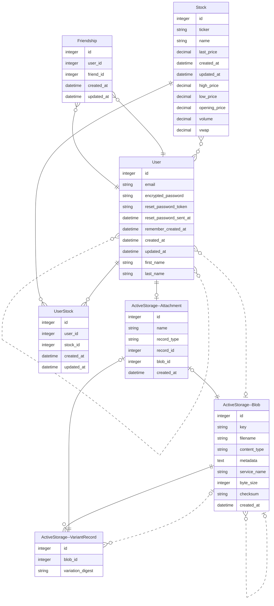

Project Name: FinancialTracker - Track Your Finances
--------------------------------------------------
Overview
-------------------------------------------
- This project aims to integrate the Polygon API into a Ruby on Rails application. The Polygon API provides real-time and historical market data for stocks, cryptocurrencies, and forex. By integrating this API into your Rails application, you can access a wealth of financial data to power various features within your application.
- https://polygon.io/

-------------------------------------------
Database:
-------------------------------------------

-------------------------------------------

Table of Contents
-----------------------------------------
-	Installation
-	Usage
-	Contributing
________________________________________
Installation
----------------------------------------
To get started with this project, follow these steps:
- Ensure Ruby Version 3.0.2 is Installed:

Make sure you have Ruby version 3.0.2 installed on your system. You can check your Ruby version by running:
```
ruby --version
```
- Clone the Repository:

Clone this repository to your local machine using Git:
```
git clone 
```
-	Install Gem Dependencies:

Install gem dependencies by running:
```
bundle install
```
-	Setup Credentials:

Before you can use external APIs or services, such as the Polygon API, you need to set up your credentials. Replace "code --wait" with your preferred text editor command. Run the following command to edit your credentials file:
```
EDITOR="code --wait" rails credentials:edit
```
Add your Polygon API key under the appropriate section, like so:
```
polygon:
  api_key: "YOUR_API_KEY"
```
- Setup the Database:

Run the following command to setup the database:
```
rails db:migrate
```
- Start the Rails Server:

Start the Rails server by running:
```
rails s
```

---------------------------------------------------------------------
Usage
-------------------------------------------------------------------
Once the server is running, you can access the application by navigating to http://localhost:3000 in your web browser. From there, you can explore the features and functionalities of the FinancialTracker application.
Contributing
Contributions are welcome! Here's how you can contribute to this project:
1.	Fork the Repository:
Fork the repository on GitHub by clicking the "Fork" button.
2.	Create a New Branch:
Create a new branch for your feature:
bashCopy code
git checkout -b feature/your-feature-name 
3.	Make Your Changes:
Make your changes to the codebase.
4.	Commit Your Changes:
Commit your changes with a descriptive commit message:
bashCopy code
git commit -am 'Add some feature' 
5.	Push to the Branch:
Push your changes to the branch on your forked repository:
bashCopy code
git push origin feature/your-feature-name 
6.	Create a New Pull Request:
Create a new Pull Request on GitHub. Please make sure to update tests as appropriate.

-----------------------------------------------------------------------
Demo
-------------------------------------------------------------------------


